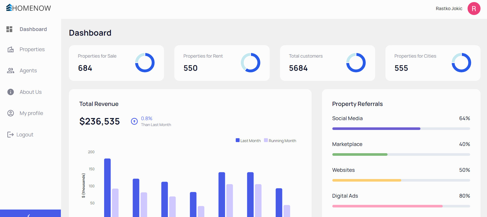
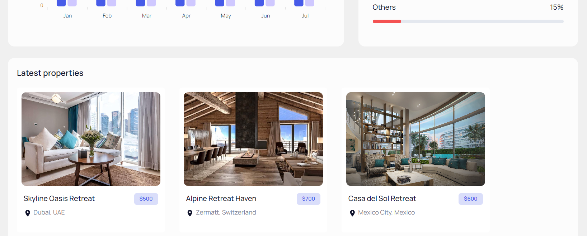
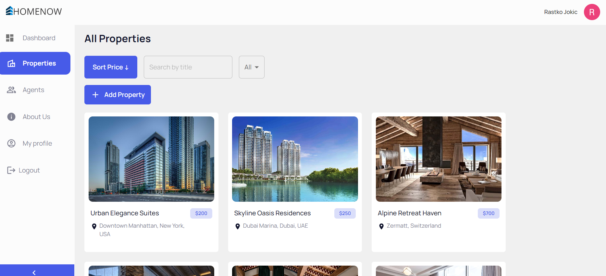
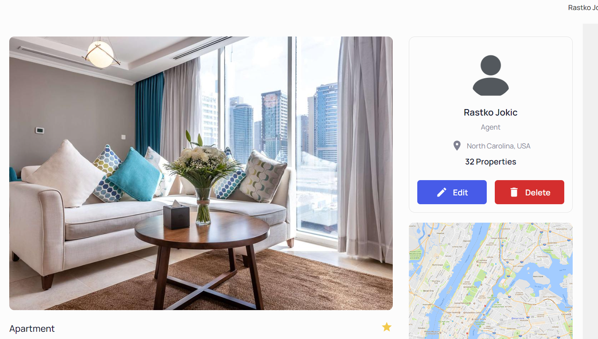
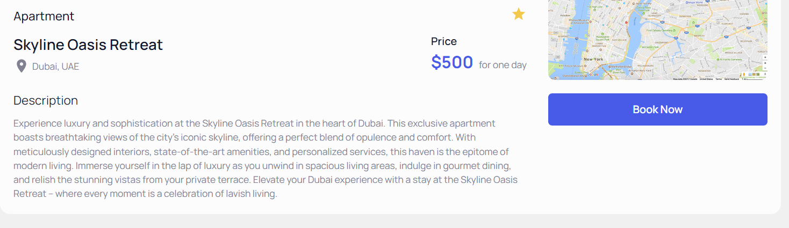
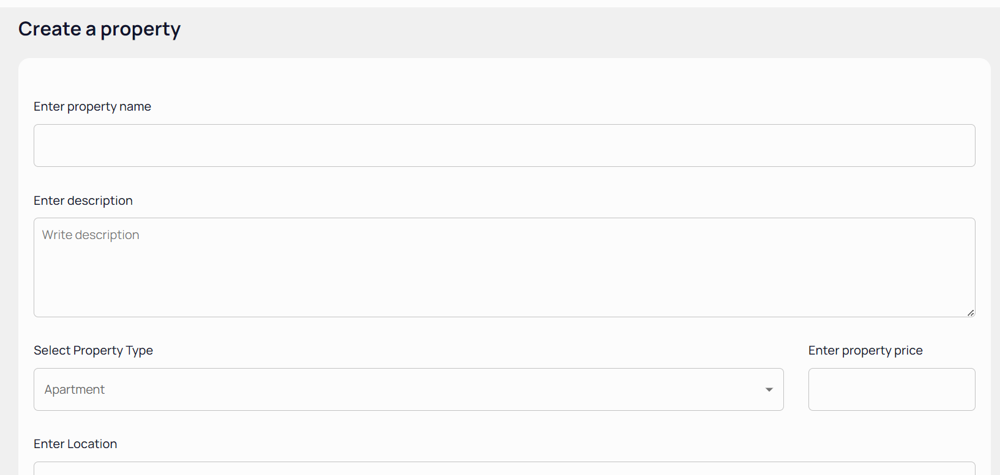
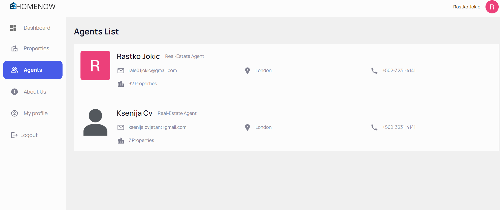
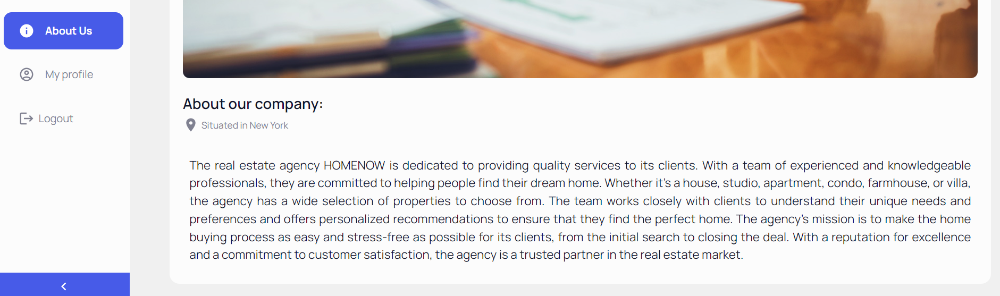

# HomeNow  FullStack Web Application

## Overview
HomeNow is a web application that allows agents to list their properties while enabling users to browse and reserve them. The application also allows agents to create, edit, and delete properties. The main goal of the application is to provide a platform for agents to showcase their properties and help users find their dream homes. This application is created with the intention of making the process of finding and reserving properties easier for everyone.

## Features
- User Authentication:
  - Users can log in using their Google accounts.
  - Authentication is managed through Google Auth via Google Cloud and API keys.

- Property Management:
  - Agents can list, edit, and delete properties.
  - Users can browse properties, filter by name or type, and view property details.
  - Property details include photos, location, price, and amenities.

- Reservation System:
  - Users can easily reserve properties they are interested in.
  - Users can contact agents for further inquiries or negotiations.

## MVC Architecture
The application is developed using the MVC (Model-View-Controller) pattern, providing clear separation of application logic, presentation, and user interaction. This pattern makes the code organized, easier to maintain, and facilitates future updates and modifications.

## Technologies Used
- MERN Stack (MongoDB, Express.js, React.js, Node.js)
- TypeScript for static typing and enhanced JavaScript functionality
- Google Auth for user authentication
- Cloudinary for image optimization and storage

## Deployment
The application is deployed using Vercel, a platform for deploying frontend applications. Both the frontend and backend are deployed separately, and the server communicates with the client via two distinct deployments.

## Team Collaboration
Our MERN project was a collaborative effort that emphasized effective teamwork, communication, and problem-solving. Here's how we collaborated as a team:

- **Task Assignment:** Roles and responsibilities were assigned based on expertise and interests. Each team member contributed to different aspects of the project, such as frontend development, backend development, database design, UI/UX design, or testing.

- **Regular Meetings:** We conducted regular team meetings to discuss progress, address challenges, and plan upcoming tasks. These meetings helped us stay aligned with project goals, share updates, and brainstorm solutions collectively.

- **Version Control with Git:** Git was used for version control, allowing seamless collaboration on code changes, tracking modifications, and managing concurrent development efforts through branching and merging strategies.

- **Code Reviews:** Regular code reviews ensured code quality, adherence to coding standards, and consistency across the codebase. Team members provided feedback, suggestions for improvement, and identified potential bugs or issues.

- **Documentation:** Comprehensive documentation covered various aspects of the project, including architecture, API endpoints, data models, deployment instructions, and troubleshooting guidelines. Documentation served as a valuable resource for onboarding new team members and facilitating knowledge transfer.

- **Shared Tools and Platforms:** Collaborative tools and platforms like Slack, Trello or Jira, Google Drive, and Zoom facilitated efficient communication, task management, document sharing, and virtual meetings among team members.

## Project access:
- You can access our team project by visiting the online hosting link we have deployed using Vercel.

- To view the project, simply follow this link: https://homenow-frontend.vercel.app/

- Thank you for your interest in our project!

## Application screenshots
### Login
- **Description:** Log in using Google Auth to securely access personalized features.
  

  

### Dashboard
- **Description:** Agent dashboard, providing an overview of your web app statistics, revenue, referrals and latest properties.
   

  
  

### Properties
- **Description:** Explore a diverse range of available properties with detailed information, with the option to search them by name, sfilter by property name or sort by price - ascending or descending.
   

  

### Property Details
- **Description:** Dive deeper into specific properties to view detailed information and high-quality images and description, with the option to book the property.
     

  
  

### Create a New Property
- **Description:** Fill out fields about the new property: Name, Location, Price, Description and upload your image.
  

  

### Agents List
- **Description:** Browse through a list of trusted agents managing different properties, with access to view more information about them.
   

  

### About Page
- **Description:** Find more about our application.
   

    
  

